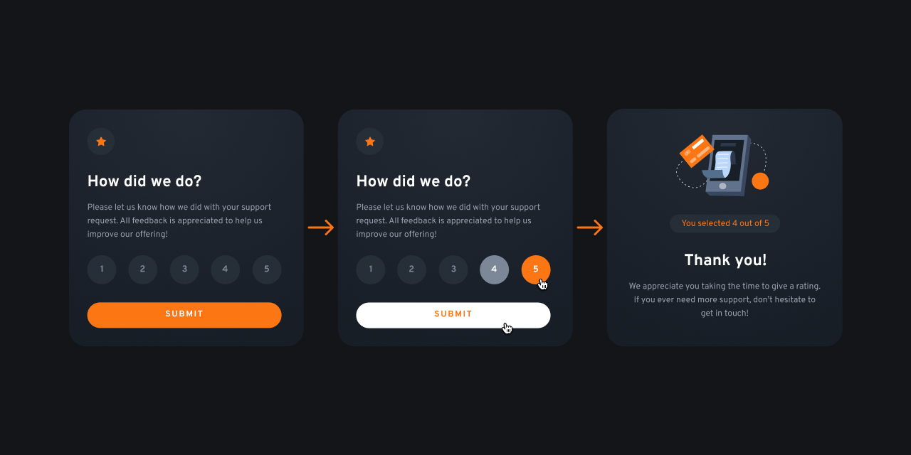
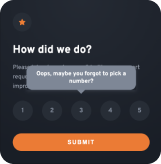

# Frontend Mentor - Interactive rating component

This is a solution to the [Interactive rating component challenge on Frontend Mentor](https://www.frontendmentor.io/challenges/interactive-rating-component-koxpeBUmI).
Frontend Mentor challenges help you improve your coding skills by building realistic projects.

## Table of contents

- [Overview](#overview)
  - [The Challenge](#the-challenge)
  - [Screenshot](#screenshot)
  - [Links](#links)
    - [My Process](#my-process)
      - [Build with](#built-with)
      - [What I learned](#what-i-learned)
      - [Continued Development](#continued-development)
      - [Useful Resources](#useful-resources)
- [Author](#author)
<!-- - [Acknowledgments](#acknowledgments) -->

## Overview

### The Challenge

Users should be able to:

- Select and submit a number rating
- See the "Thank you" card state after submitting a rating
- View the optimal layout for the app depending on their device's screen size
- See hover states for all interactive elements on the page

### Screenshot



### Links

- Solution URL: [Solution](https://www.frontendmentor.io/solutions/responsive-web-design-rating-component-using-scss-flex-javascript-BJJWQVhI5)
- Live Site URL: [Live](https://grifano.github.io/FM__Interactive-rating-component/)

## My process

### Built with

- Semantic HTML5 markup
- CSS custom properties
- SASS/SCSS
- JavaScript
- Flexbox
- Responsive Web Design

### What I learned

How to create a tooltip. They're needed if we want to hide users if they have missed something or get a mistake.



I am still interested in how to make this cute little arrow not so aggressive. But, setting up the border-radius isn't a good choice for that :(
Also, there is amathing tutorial about making rating. We can use label as an visible element, and hide the imput ratio.

```css
/* Rating */
input {
  display: none;
  &:checked ~ label {
    color: $white;
    background-color: $primary;
  }
}
label {
  display: inline-flex;
  justify-content: center;
  align-items: center;
  width: 51px;
  height: 51px;
  font-weight: 700;
  line-height: 1;
  font-size: 16px;
  letter-spacing: 0.2px;
  text-align: center;
  background-color: $darkblue;
  border-radius: 50%;
  color: $mediumgrey;
  cursor: pointer;
  transition: all 0.3s ease 0s;
  &:hover {
    color: white;
    background-color: $mediumgrey;
  }
  @media (max-width: 375px) {
    width: 42px;
    height: 42px;
    font-size: 14px;
    letter-spacing: 0.17px;
  }
}

/* Tooltip */
.tooltip {
  visibility: hidden;
  opacity: 0;
  width: 80%;
  position: absolute;
  top: -70%;
  left: 50%;
  transform: translateX(-50%);
  box-shadow: 0px 4px 8px rgba(124, 135, 152, 0.2);
  transition: all 0.3s ease 0s;
  &__msg {
    position: relative;
    display: flex;
    align-items: center;
    justify-content: center;
    font-size: 15px;
    font-weight: 700;
    line-height: 19px;
    padding: 12px 24px;
    background: $mediumgrey;
    border-radius: 15px;
    text-align: center;
    color: $white;
    outline: none;
    border-style: none;
    &::after {
      content: "";
      position: absolute;
      top: 100%;
      left: 50%;
      margin-left: -10px;
      border-width: 10px;
      border-style: solid;
      border-color: $mediumgrey transparent transparent transparent;
    }
  }
}
```

How to use forEach method to going through result of querySelectorAll. Add class to element depending of the if statement.

```js
const msg = document.getElementById("msg");
const tooltip = document.getElementById("tooltip");
const btnSubmit = document.getElementById("btn-submit");
const ratingValue = document.querySelectorAll("input");
var resultString = document.getElementById("result-msg");

// Success message control
btnSubmit.addEventListener("click", function (e) {
  e.preventDefault();

  // Display selected rating
  ratingValue.forEach((element) => {
    if (element.checked) {
      msg.classList.add("show");
      resultString.innerText = `You selected ${element.value} out of 5`;
    } else {
      tooltip.classList.add("show");
    }
  });
});
```

### Continued development

I'm focusing on improving my programming skills with HTML&CSS and JavaScript. My plan is to get comfortable with the basics before I going to dive into the Frontend framework/library like React, Angular, Vue, etc.
I hope that such amzing tools like [Frontend Mentor](https://www.frontendmentor.io/) and [Uxcel](https://uxcel.com?invite=EE4PBID94EEH) help me with my this.

### Useful resources

[Frontend Mentor](https://www.frontendmentor.io/) - Get a challenge and try to make them as close to a mockup as you can.  
[Uxcel](https://uxcel.com?invite=EE4PBID94EEH) - improv UX/UI Design skills, by reading the article and check your new knowledge by passing a quiz.  
[Create a Star Rating Widget with CSS in 9 Steps](https://medium.com/codex/create-a-star-rating-widget-with-css-in-9-steps-fe323352dba4)

## Author

- Website - [Serhii "Gr[i]fano" Orlenko"](https://grifano.webflow.io/)
- Frontend Mentor - [@Grifano](https://www.frontendmentor.io/profile/Grifano)
- Twitter - [@Grifano](https://twitter.com/OrlenkoSerhii)
- LinkedIn - [@Grifano](https://www.linkedin.com/in/serhii-orlenko-44aaa4a3/)

<!-- ## Acknowledgments -->
